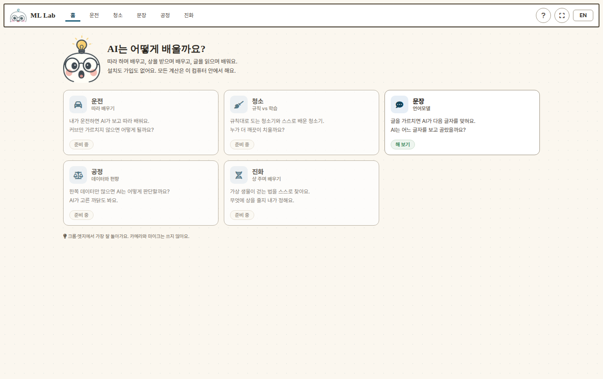
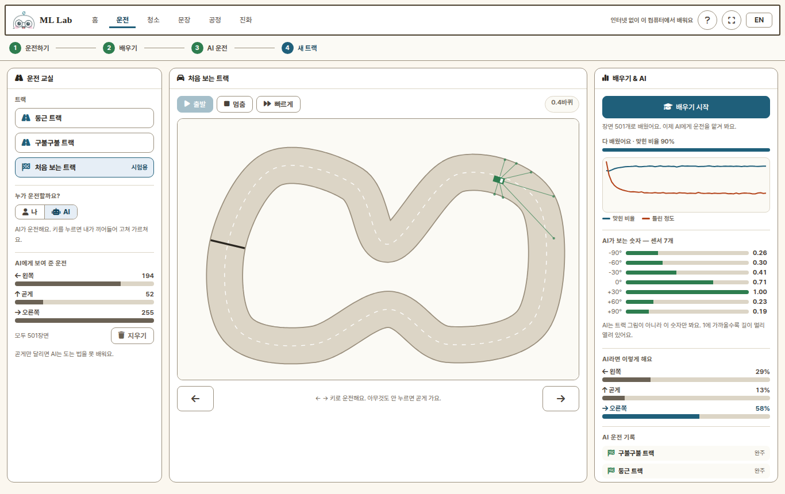
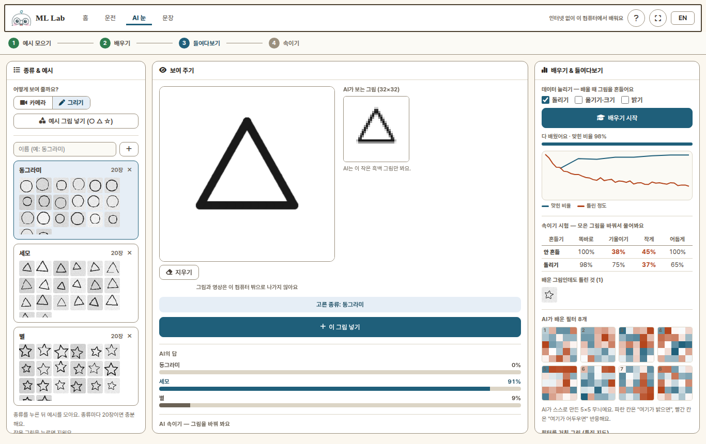
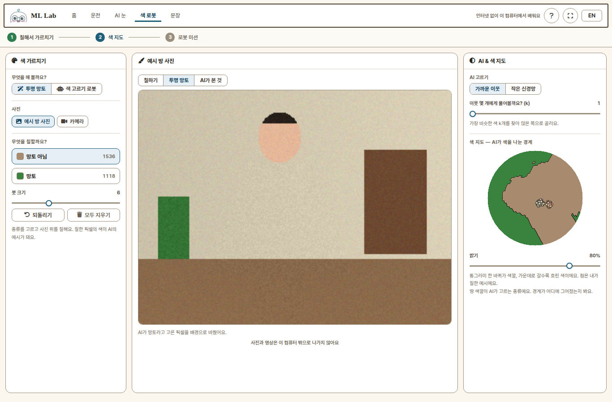
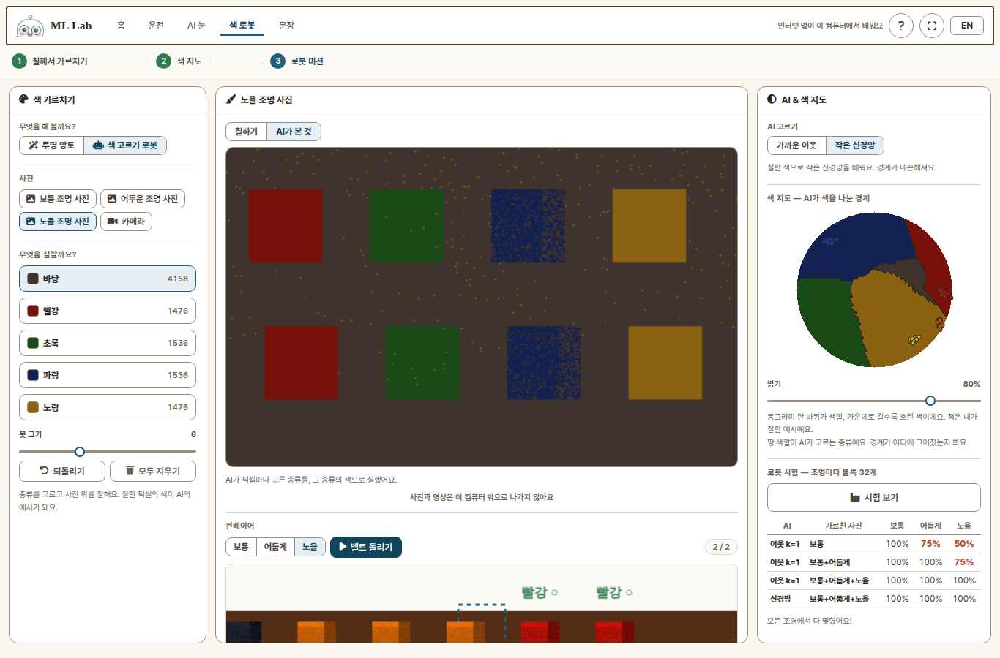
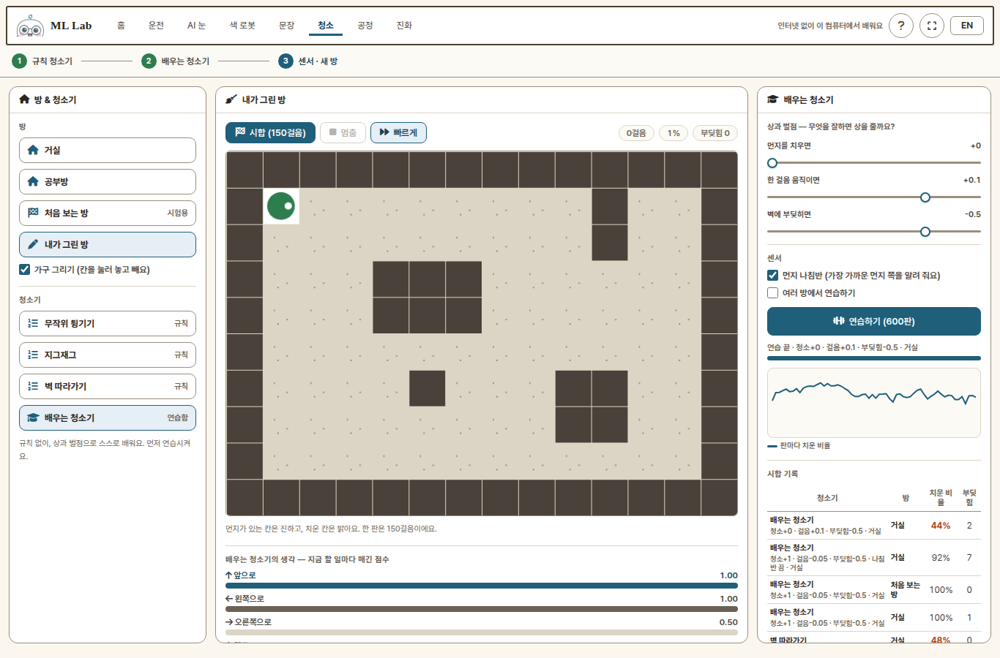
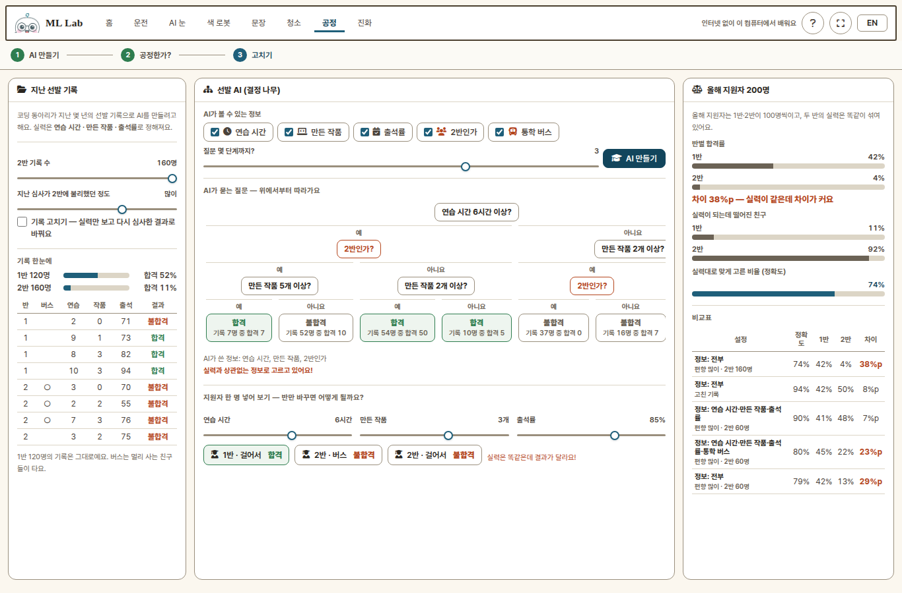
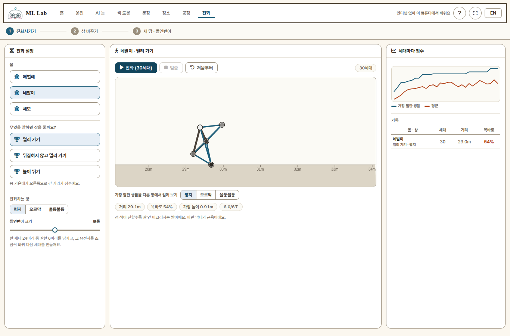
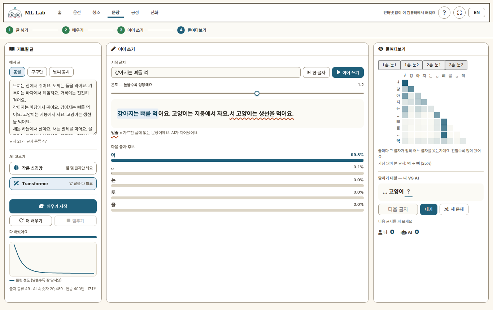

  

<h1 align="center">ML Lab</h1>

<b>AI가 어떻게 배우는지, 브라우저에서 바로 해 보며 알아봐요.</b>

<a href="docs/LESSONS.md"><b>📘 교사용 수업안 (활동 7개 · 20차시 · 코스 4가지)</b></a>

ML Lab 은 어린이와 수업을 위한 **머신러닝 놀이터**입니다.
설치도 가입도 없이 크롬·엣지에서 바로 열립니다. 카메라가 없어도 모든 활동을 할 수 있고,
**모든 학습과 계산은 이 컴퓨터 안에서** 끝납니다. 인터넷으로 나가는 데이터가 없습니다.

GPU 가 없는 교실 PC 에서도 돌아가도록, 모델을 전부 작게 직접 짰습니다.
활동마다 **2~3차시 수업안**이 있습니다 ([교사용 수업안](docs/LESSONS.md)). 폰에서는 헤더에 홈과 지금 탭만 보이고, 다른 활동은 홈 카드로 들어가요.

## 활동

| 탭 | 무엇을 배우나 | 차시 |
|---|---|---|
| **운전** | 따라 배우기(모방학습) — 내가 운전하면 AI가 따라 해요 | 2 |
| **AI 눈** | 합성곱 신경망 — 필터·특징 지도 보기, 데이터 늘리기 | 3 |
| **색 로봇** | 결정 경계 — 투명 망토, 색 지도, 조명이 바뀌어도 고르는 로봇 | 3 |
| **문장** | 언어모델 — 다음 글자 맞히기, 어텐션, 환각 | 3 |
| **청소** | 규칙 vs 강화학습 — 규칙 청소기와 스스로 배운 청소기 겨루기, 상 설계 | 3 |
| **공정** | 데이터와 편향 — 결정 나무, 대리 변수, 기록 고치기 | 3 |
| **진화** | 진화 · 상 설계 — 가상 생물이 걷는 법을 찾아요, 엉뚱한 꾀 | 3 |

차시별 흐름 · 핵심 발문 · 예상 결과 · 평가 · 주의점, 그리고 활동을 묶은 **코스 4가지**(입문 · 데이터 · Physical AI · 윤리)는
**[교사용 수업안](docs/LESSONS.md)** 에 모아 두었습니다. 아래는 활동별 요약입니다.

## 운전 — 내가 운전하면 AI가 따라 배워요

1. **운전하기** — 트랙을 고르고 **출발**. `←` `→` 키(또는 화면 버튼)로 운전해요. **속도**는 느리게 · 보통 · 빠르게.
   아무것도 안 누르면 곧게 가요. 운전하는 동안 **센서 7개 숫자 + 내가 고른 운전**이 기록돼요.
   바퀴 수보다 **왼쪽·오른쪽으로 도는 장면이 골고루(각 30장면)** 있는 게 중요해요 — 화면 안내가 "넉넉해요" 로 바뀌면 배우기.
2. **배우기** — 작은 신경망이 "이 숫자일 때 사람은 왼쪽/곧게/오른쪽" 을 배워요. 1초도 안 걸려요.
3. **AI 운전** — "누가 운전할까요?" 에서 **AI** 를 고르고 출발. AI는 트랙 그림을 못 보고 숫자 7개만 봐요.
   AI가 헤매면 **키를 눌러 끼어들어** 고쳐 가르칠 수 있어요. 끼어든 장면도 기록돼요.
4. **새 트랙** — 가르칠 때 안 쓴 **처음 보는 트랙**에서도 달릴까요?

### 수업 아이디어

- **곧게만** 운전해서 가르치면? → AI는 첫 커브에서 바로 부딪혀요. *데이터가 곧 실력*
- 둥근 트랙에서만 가르치고 처음 보는 트랙에 보내 보기 → *배운 적 없는 상황(일반화)*
- 처음부터 다 운전하지 말고, AI가 헤매는 곳에서만 끼어들어 가르쳐 보기 → 적은 장면으로도 좋아지는지 비교

## AI 눈 — 그림 보는 눈을 처음부터 만들어요

이미 배운 모델을 가져다 쓰지 않고, **작은 합성곱 신경망(필터 8개)을 매번 처음부터** 가르칩니다.
그림은 **그리기 판**, **카메라**(가운데 점선 네모), **예시 그림 세트(○ △ ☆)** 로 넣어요 — 카메라가 없어도 됩니다.

### 3차시 수업안

| 차시 | 목표 | 활동 | 남는 것 |
|---|---|---|---|
| 1 | AI는 그림을 숫자로 본다 | 종류 만들기 → 예시 모으기 → 배우기 → 새 그림으로 시험. "AI가 보는 그림(32×32)" 확인 | 모둠 모델, 맞힌 비율 |
| 2 | AI는 무엇을 보고 고를까 | 여러 그림을 보여 주며 **특징 지도** 8장 중 어느 것이 켜지는지 관찰, 칸마다 "무엇을 찾나?" 적기 | 필터 해석 메모 (모델 파일에 함께 저장) |
| 3 | 처음 보는 조건에서도 될까 | **AI 속이기**(기울이기·크기·밝기)로 약점 찾기 → **데이터 늘리기**를 하나씩 켜고 다시 배우기 → **속이기 시험 표**로 전후 비교. 모델을 내보내 다른 모둠 그림으로 교차 시험 | 속이기 시험 전후 비교표 |

3차시에서 이런 결과가 나옵니다 (예시 그림 세트로 한 번 잰 값 — 배울 때마다 조금씩 달라요):

| 흔들기 | 똑바로 | 기울이기 | 작게 | 어둡게 |
|---|---|---|---|---|
| 안 흔듦 | 100% | 40% | 42% | 100% |
| 돌리기 | 97% | **80%** | 33% | 58% |

- **돌리기**는 기울인 그림을, **옮기기·크기**는 작게 구석에 그린 그림을 고쳐요 — 약점에 맞는 흔들기를 골라야 해요.
- 하나를 고치면 다른 것이 나빠지기도 해요 (위 표의 "어둡게"). 토의 거리로 좋아요.

## 색 로봇 — 칠해서 가르치면 AI가 픽셀마다 골라요

사진 위에 붓으로 **"이건 망토, 이건 망토 아님"** 처럼 칠하면, 칠한 픽셀의 색(숫자 3개)이 AI의 예시가 됩니다.
사진은 **예시 사진**(방·컨베이어, 조명 3가지) 또는 **카메라**("멈추고 칠하기")로 넣어요.

### 3차시 수업안

| 차시 | 목표 | 활동 | 남는 것 |
|---|---|---|---|
| 1 | 가르친 대로 본다 | **투명 망토**: 망토와 나머지를 칠해 가르치고 결과 보기. 초록 화분·셔츠까지 사라지는 실패 → 화분을 "망토 아님"으로 칠해 고치기 | 전후 화면 |
| 2 | AI의 경계선 | **색 지도**에서 AI가 그은 경계 보기. 가까운 이웃 k=1 ↔ k=15 ↔ 작은 신경망을 바꾸며 경계가 어떻게 달라지는지 비교 | 경계 그림, 비교 메모 |
| 3 | 로봇에게 맡기기 | **색 고르기 로봇**: 보통 조명 사진만 가르치고 **로봇 시험** → 어두운·노을 조명에서 틀림 → 그 조명 사진도 칠해 다시 시험. 컨베이어로 구경 | 로봇 시험 전후 표 |

이런 결과가 나옵니다 (예시 사진, 가까운 이웃 k=1, 브라우저에서 한 번 잰 값):

| 가르친 사진 | 보통 | 어둡게 | 노을 |
|---|---|---|---|
| 보통 | 100% | 75% | 50% |
| 보통+어둡게 | 100% | 100% | 75% |
| 보통+어둡게+노을 | 100% | 100% | 100% |

- 어두운 조명을 가르쳐도 **노을은 따로** 가르쳐야 해요 — 배운 적 없는 상황은 AI가 몰라요.
- 투명 망토에서 화분을 "망토 아님"으로 칠하면 화분은 고쳐지지만, 망토의 어두운 주름 일부도 "망토 아님"이 돼요 (망토 약 100% → 95%). **비슷한 색은 AI도 나누기 어려워요.**
- factory-lab 의 컨베이어 수업과 이어서 할 수 있어요.

## 청소 — 규칙 청소기 vs 배우는 청소기

| 차시 | 목표 | 활동 | 남는 것 |
|---|---|---|---|
| 1 | 규칙의 힘과 한계 | 규칙 청소기 3종(무작위 튕기기·지그재그·벽 따라가기) 시합 150걸음. 가구를 직접 그려 방을 바꿔 보기 | 시합 기록 |
| 2 | 상과 벌점으로 배운다 | **배우는 청소기**(Q-러닝) 연습 → 시합. "청소기의 생각"(할 일마다 점수) 보기. 상을 바꿔 보기 — 청소 상 0·움직이면 상이면? | 상 설정별 비교 |
| 3 | AI가 무엇을 보느냐 | **먼지 나침반** 센서를 끄고 연습 → 비교. 처음 보는 방·내가 그린 방에서 시합 | 센서별 비교 |

잰 값 (150걸음, 연습 600판, 시드 4개):

| 청소기 | 치운 비율 |
|---|---|
| 규칙 3종 | 13~56% |
| 배우는 청소기 (기본 상) | **95~100%** (처음 보는 방도 95~100%) |
| 먼지 나침반 끔 | 47~96% (대체로 떨어져요, 모둠마다 달라요) |
| 청소 상 0 · 움직이면 +0.1 | 22~75% (청소는 뒷전 — 상을 잘못 준 예) |

## 공정 — 지난 기록으로 배운 AI는 공정할까?

가상의 "코딩 동아리 선발 AI" 예요. 실력은 연습 시간·만든 작품·출석률로 정해지는데,
**지난 심사가 2반에 불리했어요.** 통학 버스는 2반 친구들이 주로 타요.
AI는 지난 기록으로 **결정 나무**를 만들고, 실력이 똑같이 섞인 올해 지원자(두 반 100명씩)로 시험해요.

| 차시 | 목표 | 활동 | 남는 것 |
|---|---|---|---|
| 1 | AI는 기록을 따라 한다 | 지난 기록 보기 → AI 만들기 → **나무 그림** 읽기 (어떤 질문을 먼저 하나) | 나무 읽기 메모 |
| 2 | 공정한가? | 두 반 합격률 비교. **"2반인가"를 빼면?** → "통학 버스"가 대신 쓰여 차이가 남아요 (대리 변수). **지원자 한 명 넣어 보기**: 실력은 그대로, 반·버스만 바꾸기 | 비교표 |
| 3 | 어떻게 고칠까 | **기록 고치기**(실력만 보고 다시 심사) vs **2반 기록만 늘리기** vs 정보 빼기 — 비교표로 정리하고 토의 | 비교표, 토의 |

잰 값 (지난 기록 시드 6개, 질문 3단계):

| 설정 | 정확도 | 두 반 합격률 차이 |
|---|---|---|
| 편향된 기록 · 정보 전부 | 73~81% | **22~30%p** ("2반인가"를 물어요) |
| "2반인가" 뺌 | 74~82% | **22~28%p** ("통학 버스"를 물어요) |
| 반 · 버스 뺌 | 78~93% | -7~1%p |
| **기록 고침** · 정보 전부 | **85~94%** | -8~1%p |
| 2반 기록 2배 (편향 그대로) | 74~85% | 21~38%p — 편향된 기록은 많이 모아도 소용없어요 |

화면은 늘 같은 지난 기록(시드 1)을 써서, 모든 모둠이 같은 결과를 봐요.

## 진화 — 가상 생물이 걷는 법을 찾아요

점·뼈·근육으로 된 생물 24마리를 움직여 보고, 잘한 6마리의 유전자를 조금씩 바꿔 다음 세대를 만들어요.
유전자는 근육마다 세기·박자, 전체 빠르기, 발마다 미끄러움이에요.

| 차시 | 목표 | 활동 | 남는 것 |
|---|---|---|---|
| 1 | 진화로 배운다 | 몸(애벌레·네발이·세모)을 고르고 30세대 진화. 세대마다 점수 그래프, 가장 잘한 생물 다시 보기 | 몸별 기록 |
| 2 | 상을 어떻게 줄까 | **"멀리 가기"** 만 주면 굴러가는 꾀(똑바로 선 시간이 짧아요) → **"뒤집히지 않고 멀리 가기"** 로 고치기. "높이 뛰기" 는 몸을 튕겨 날리는 꾀 | 상별 비교 |
| 3 | 처음 보는 땅 · 돌연변이 | 평지에서 진화한 생물을 오르막·울퉁불퉁한 땅에 보내기. 돌연변이 크기 바꿔 보기 | 땅별 기록 |

잰 값 (30세대, 시드 3개): 멀리 가기 애벌레 7~10m → **20m**, 네발이 7~14m → **27~32m** (똑바로 33~57%) ·
뒤집히지 않고 멀리 가기: 똑바로 **75~100%**, 8~14m. 30세대는 개발 서버에서 약 1.6초.

## 문장 — 나만의 작은 언어모델

1. **글 넣기** — 가르칠 글을 쓰거나 예시(동물 · 구구단 · 날씨 동시)를 골라요.
2. **AI 고르기** — 두 가지를 비교해요.
   - **작은 신경망**: 바로 앞 글자 몇 개(1~8)만 보고 다음 글자를 골라요.
     "앞을 몇 글자 볼까요?"를 1로 내리면 문장이 금방 무너져요.
   - **Transformer**: 앞 글(최대 32글자)을 다 보고 골라요. ChatGPT 와 같은 구조를 아주 작게 만든 거예요.
3. **배우기** — 몇 초~수십 초. "틀린 정도" 그래프가 내려가는 걸 봐요. **더 배우기**로 이어서 배우고, **멈추기**로 중간에 멈춰요.
4. **이어 쓰기** — 시작 글자를 주면 AI가 이어 써요. **온도**를 올리면 엉뚱해져요.
   가르친 글에 **없는 문장에는 물결 밑줄**이 생겨요 — AI가 지어낸 거예요.
   **한 글자** 버튼으로 한 글자씩 고르는 과정도 볼 수 있어요.
5. **들여다보기** — 작은 신경망은 "AI가 보는 글자"를, Transformer 는 **층·눈(헤드)마다 어텐션 표**를 보여 줘요.
6. **맞히기 대결** — 가르친 글에서 문제가 나와요. 나와 AI 중 누가 다음 글자를 더 잘 맞힐까요?

### 수업 아이디어

- **구구단** 예시는 2~6단만 가르쳐요. `7 × 8 =` 을 넣으면 AI가 그럴듯한 틀린 답을 지어내요.
  → *AI는 계산하지 않고 글자 모양을 흉내 낸다* (환각)
- 같은 글로 **작은 신경망(앞 1글자)** 과 **Transformer** 를 번갈아 배워 보고 이어 쓴 글을 비교해요.
  → *앞을 더 많이 볼수록 말이 된다*

## 이렇게 열어요

- 웹: GitHub Pages 주소로 바로 엽니다.
- 직접 서빙: `file://` 로는 열리지 않아요(모듈 워커). `python3 -m http.server 8080` 처럼 http 로 여세요.

헤더의 **EN** 버튼을 누르면 화면이 영어로 바뀌고, 예시 글도 영어로 나옵니다.

개발·배포는 [DEVELOP.md](DEVELOP.md) 를 보세요.

## 라이선스

MIT. 글꼴 Pretendard 는 SIL OFL 1.1, 아이콘 Font Awesome Free 는 각 라이선스를 따릅니다.
